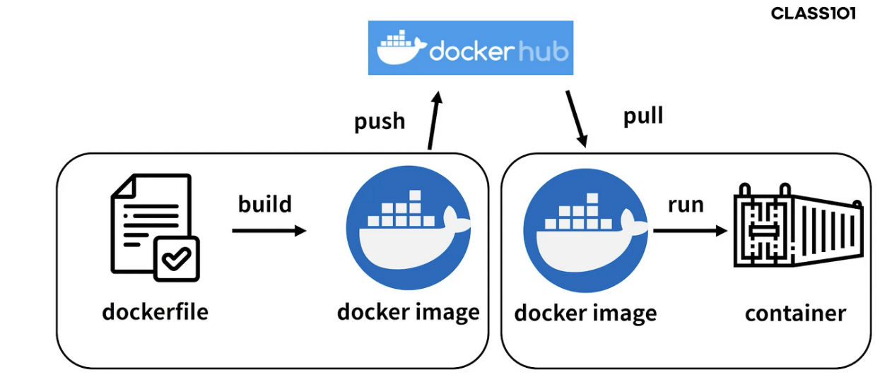

# Teras

## 

## dockerfile 생성

```
FROM openjdk:8
// FROM amazoncorretto:11 ==> amazon corretto 11 사용할 경우
ARG JAR_FILE=build/libs/*.jar
COPY ${JAR_FILE} app.jar
ENTRYPOINT ["java","-jar","/app.jar"]
// ENTRYPOINT ["java","-jar","-Dspring.profiles.active=prod","/app.jar"]
// => 설정파일을 분리해서 사용할 때
// java -jar -Dspring.profiles.active=prod app.jar
```


### dockerfile 경로에서 코드 실행 or export로 jar 파일 생성


### docker hub 가입

```
https://hub.docker.com/
```


### 도커 repository 생성

.png)

이름과 public 생성 후create

```
docker build --build-arg DEPENDENCY=build/dependency -t 도커허브 ID/Repository --platform linux/amd64 .
```


### docker image push

```
docker push 경로(ex:tim960321/sample)
```

```
denied: requested access to the resource is denied 라고 뜰 시 로그인해주기
docker login
git bash의 경우 winpty docker login
```

https://hub.docker.com/repository/docker/tim960321/sample


### AWS EC2 인스턴스에 생성한 후 어플리케이션 배포

```
도커 설치
$ sudo yum install docker
도커 실행

$ sudo systemctl start docker
도커 허브에 존재하는 이미지 파일 pull

$ sudo docker pull juhyun419/sample
도커 이미지를 통해 스프링 부트 애플리케이션 배포

$ sudo docker run -p 8080:8080 juhyun419/sample
 
```

.png)

최종적으로 해당 ec2의 ip로 접속시 성공
