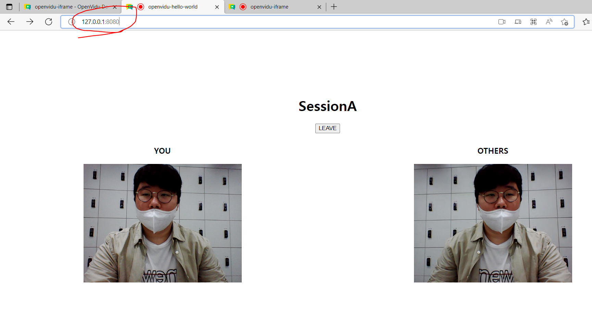

## Openvidu 체험

#### 참고자료 : https://www.lainyzine.com/ko/article/a-complete-guide-to-how-to-install-docker-desktop-on-windows-10/ (Docker설치 완벽 가이드)

#### https://velog.io/@ohsg97/openVidu-tutorial-%EC%8B%9C%EC%9E%91%ED%95%98%EA%B8%B0 (openvidu 시작하기)


#### 결과: 


### 0719 오늘의 한 일

#### 1. ERD 작업 완료

#### 2.기술 스택 협의


### 0720 오늘의 한 일

#### 1. spring directory 구조설계

#### 2. Openvidu 기술 정리

```
Openvidu Browser
클라이언트 측에서 사용할 라이브러리
화상 통화를 만들고, 비디오와 오디오를 주고받을 수 있게끔 도와준다
Openvidu에서 사용할 수 있는 모든 작업은 Openvidu 브라우저를 통해 관리된다


Openvidu Server
서버 측 내용을 처리하는 애플리케이션
Openvidu 브라우저에서 작업을 수신하고, 비디오 통화를 설정하고, 관리하는 데 필요한 모든 작업을 수행한다
명시적으로 구현할 필요는 없고, 실행한 뒤에 접근할 수 있는 IP 주소만 알고 있으면 끝
```

 ```
 Openvidu는 kurento라는 미디어 서버를 한번 더 래핑하여 사용자가 내부 구현을 몰라도 된다는 장점있음
 ```

##### 2-1. 사용 기술

docker 20.10.12버전

npm

##### 2-2. 구현 순서

튜토리얼 파일 clone하기

```
git clone https://github.com/OpenVidu/openvidu-tutorials.git -b v2.21.0
```

git bash로 openvidu-library-react 폴더 이동 후 파일 실행

```
cd openvidu-tutorials/openvidu-library-react
npm install
npm start
```

자동으로 localhost:3000이 뜰 것이다.


동일한 경로의 다른 터미널을 열고 도커를 실행한다.

1.docker desktop 실행

2.

```
docker run -p 4443:4443 --rm -e OPENVIDU_SECRET=MY_SECRET openvidu/openvidu-server-kms:2.21.0
```


localhost:3000페이지의 join을 누른다.

카메라 등이 켜지지 않는다면 chrome권한설정을 확인한다.


##### 2-3. 사용 가능한 기능

마이크 카메라, 화면 공유, 전체화면, 채팅, 카메라전환, 종료


#### 3. openvidu 기본과 pro(유료)의 차이


### 4. openvidu 1:1 연결

```
npm install -g http-server
```

```
http-server openvidu-tutorials/openvidu-hello-world/web
```

여기서는 튜토리얼의 문서를 사용했으나 개발 진척시 백엔드에서 가능할 듯


```
docker run -p 4443:4443 --rm -e OPENVIDU_SECRET=MY_SECRET openvidu/openvidu-server-kms:2.22.0
```

도커의 버전에 주의

서로 다른 ip를 연결할 매개체인 도커를 준비한다.


```
http-server openvidu-tutorials/openvidu-iframe/web
```

다른 터미널에서 실행


결과




